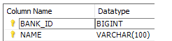
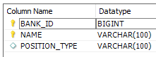

# Hibernate and Java Persistence API (JPA)

## Initial setup

[Database EER-Diagram](https://raw.githubusercontent.com/pablorotten/hibernate-course/master/img/ERR-Diagram.png)


### POM

The libraries we need are:
* Hibernate: Version 4
* log4j: configure also in log4j.properties file
* mysql-connector: Make sure that is the same version of your MySQL installation

### User Entitiy
* Create a POJO with annotations for Mapping the USER table with the User class
* Use @Table annotation for the matching the corresponding Table of the Class
* Use @Column even if is not needed and @Id for the primary key
```java
@Entity
@Table(name="FINANCES_USER")
public class User {

  @Id
  @GeneratedValue(strategy = GenerationType.IDENTITY)
  @Column(name = "USER_ID")
  private Long userId;
```

### Session Factory
The purpose of that is to handle the session, that is the interface between our application and Hibernate.
Create the session factory in a Util class using the Factory pattern.
In this class, we have to say to Hibernate where are the **annotated classes**
```java
Configuration configuration = new Configuration();
configuration.addAnnotatedClass(User.class);
```

### Hibernate properties
Setup the properties to allow Hibernate to connect with the database

### Application
With the configuration above, we can make a test and see if everything is working fine
```java
Session session = HibernateUtil.getSessionFactory().openSession();
session.beginTransaction();
session.close();
```

### Hibernate XML configuration
Instead of using the properties file, we can setup the hibernate configuration in a XML file. This is the most common approach.
You can have a look to all the properties here: https://docs.jboss.org/hibernate/orm/4.3/manual/en-US/html/ch03.html#configuration-programmatic

Also, here **we can map the classes instead of doing it in the code**

```xml
<mapping class="com.infiniteskills.data.entities.User"/>
```

Don't forget to update your SessionFactory to make sure that is using the xml configuration:
```java
configuration.configure(); // Very important
return configuration
        .buildSessionFactory(new StandardServiceRegistryBuilder()
                .applySettings(configuration.getProperties()) // use the xml configuration
                .build());
```
> ❓ Doesn't explain anything about why this code works with the XML file

## Basic Mapping Annotations

### @Access

Defines the access strategy of Hibernate to the entity attributes

```java
@Access(AccessType.FIELD)
```
Access to the attribute directly with reflection

```java
@Access(AccessType.PROPERTY)
```
Access to the attribute with the getter/setter methods. So you can add some logic there


### @Column

```java
@Column(name = "...", updatable = false)
```
Don't include these elements on update actions

```java
@Column(name = "...", nullable = false)
```
This attribute/field can't be null

```java
@Basic
```
Same as "nullable = false" but doesnt't give information to Hibernate on creating the DB Schema

### Identifiers

```java
 @GeneratedValue(strategy = GenerationType.SEQUENCE)
```
Fast but not avaliable for MySQL. Oracle supports

```java
@GeneratedValue(strategy = GenerationType.IDENTITY)
```
Auto-incremented

```java
@GeneratedValue(strategy = GenerationType.TABLE, generator = "user_table_generator")
@TableGenerator(name = "user_table_generator", table = "IFINANCES_KEYS", pkColumnName = "PK_NAME", valueColumnName = "PK_VALUE")
```
Uses another table, IFINANCES_KEYS in this case, to increment the primary key
> ❓ Don't understand

```java
@GeneratedValue(strategy = GenerationType.AUTO)
```

### @Transient
Says to hibernate to **not** map an attribute of an Entity

```java
@Transient
private boolean valid;
```
valid is an attribute of the Entitiy but is not a Column of the DB Table

### @Temporal
To deal with Date/Time types

### @Formula
Used for calculated attributes on runtime

## Hibernate Types

* Entitiy Types: have a database identity
* Vaue Types: no database identitiy
  * Basic
  * Composite Types
  * Collection

```java
@Entity
public class User {
  
  @Id
  private Long userId; //Basic Value Type
  private String firstName; //Basic Value Type
  private User referredBy; //Entity Type
  private List<String> aliases; //Collection Value Type
  private Address address; //Composite Value Type (Embedded in JPA)
}

public class Address { // Auxiliary class. Is not an entity, the values are stored in the User table
  
  private String addressLine1;
  private String addressLine2;
  private String city;
  // ...
}
```  

## Mapping Composite and Collection Types

### Mapping Composite Value Types

The Composite Value Type is an auxiliary class where are defined some attributes of the Entity.
This class is not an Entity, **doesn't have table in the DB** thus doesnt have life-cycle.
The attributes values will be mapped in the DB to Columns of the Entity that uses it.

#### @Embeddable
Create a Composite Value Type (CVT) class with the @Embeddable annotation:
```java
@Embeddable // Composite value type
public class Address {

	@Column(name="ADDRESS_LINE_1")
	private String addressLine1;

	@Column(name="ADDRESS_LINE_2")
	private String addressLine2;
	
	@Column(name="CITY")
	private String city;
}
```

For using this Composite value type class there're 2 ways:

#### @Embedded

If the @Column names of the CVT match with the column names of the Entity, you can directly use the class.
Then, write the getters and setters for all the attributes of the CVT @Embeddable class:
```java
@Entity
@Table(name="BANK")
public class Bank {

	@Embedded // Composite value type. Annotation not needed, Hibernate figures out
	private Address address = new Address();
	
	// Getters and Setters from the Address class
	public String getAddressLine1() {	return address.getAddressLine1();	}
	public void setAddressLine1(String addressLine1) { this.address.setAddressLine1(addressLine1);	}
	public String getCity() {	return address.getCity();	}
	//...
}
```

#### @Embedded + @AttributeOverrides

If not, you can still use the CVT setting in the annotations to override the column names:
```java
@Embedded
@AttributeOverrides({
   @AttributeOverride(name="addressLine1", column=@Column(name="USER_ADDRESS_LINE_1")),
   @AttributeOverride(name="addressLine2", column=@Column(name="USER_ADDRESS_LINE_2"))})
private Address address;

public Address getAddress() { return address; }
public void setAddress(Address address) { this.address = address; }
```

In this case there're no Getters and Setters of the attribures, directly create the Address object and add it:

```java
Address address = new Address();
address.setAddressLine1("line 1");
address.setAddressLine2("line2");
address.setCity("Philadelphia");
user.setAddress(address);
```
### Mapping Collections Of Basic Value Types

When you have a **One to Many** relationship in the database, you may map it as a Collection or as a Map

#### @ElementCollection: Mapping a Collection 

For "One to Many" relationships when we can represent the "Many" table as a collection of basic values such as String, Double, etc.
For those 2 tables, we are going to have only 1 Entity that will be associated to both Tables at once and will persist them. 
The Entity is going to be directly associated with the Table that hold the "One" cardinality in the relationship.

The Entity's attribute that represents the relationship with the **Many** table with have those annotations:
* @ElementCollection: This attribute is a collection of instances of another Table without Entity
* @CollectionTable(name = "Many_table_name", joinColumns = @JoinColumn(name = "FK_column_name"): Specifies which is the "Many" table and the column with the FK

One BANK has many BANK_CONTACTs so we have this relationship:
```
+------+        +--------------+
| BANK +-------<+ BANK_CONTACT |
+------+        +--------------+
```

in **BANK_CONTACT** we just want to save the name of the contact.



From the point of view of the Entity **Bank**, the **BANK_CONTACT** table is a Collection of Strings with the names of the contacts.
Can also be a List, Set...

```java
@ElementCollection // Map a collection of instances
@CollectionTable(name = "BANK_CONTACT", joinColumns = @JoinColumn(name = "BANK_ID")) // Join the id of BANK with this column of BANK_CONTACT
@Column(name = "NAME") // Each String of the contacts collection is an entry in the NAME column
private Collection<String> contacts = new ArrayList<String>();

public Collection<String> getContacts() { return contacts; }
public void setContacts(Collection<String> contacts) { this.contacts = contacts; }
```

And we use it like this:
```java
bank.getContacts().add("Joe");
bank.getContacts().add("Mary");
```

This will add to the **BANK_CONTACT** table 2 new entries.

#### @MapKeyColumn: Mapping a Map

When we can represent the "Many" table a Map of simple values, is very similar as @ElementCollection.
But you also have to map the key of the map using @MapKeyColumn(name = "KEY_COLUMN") where you have to specify which Column do you want yo use a Key of the Map.

In this case, we also want to save the "POSITION_TYPE":



From the point of view of the Entity **Bank**, we can map this Table in a Map, where the key is the "POSITION_TYPE" and the value is the "NAME"

```java
//Mapping a Map
@ElementCollection
@CollectionTable(name="BANK_CONTACT", joinColumns=@JoinColumn(name="BANK_ID"))
@MapKeyColumn(name="POSITION_TYPE") // Map the column for key of the Map
@Column(name="NAME")
private Map<String, String> contacts = new HashMap<String, String>();
```

Add the contacts in the map:
```java
bank.getContacts().put("MANAGER", "Joe");
bank.getContacts().put("TELLER", "Mary");
```

### Mapping A Collection Of Composite

With the @ElementCollection approach we can Map a Collection of Basic values (String, Double, ...).
But what if we need to Map a Collection something more complex, a collection of CVTs?

For example, we want to save a List of **Addresses** for an **User**.
So we need a table for saving those Addresses in the DB. Is very similar to the case of the **BANK** and **BANK_CONTACT**.
But **Address** is more complex than **BANK_CONTACT**, we can't save an **Address** in a String Collection or a Map like we did with **BANK_CONTACT**.
We need a Collection of CVT **Address**:

The Entity's attribute that represents the relationship with the **Many** table has those annotations:
* @ElementCollection
* @CollectionTable(name = "Many_table_name", joinColumns = @JoinColumn(name = "FK_column_name")
* @AttributeOverrides: Same as with CVT

```
FINANCES_USER has many USER_ADDRESS 
USER_ADDRESS has one FINANCES_USER

+---------------+        +--------------+
| FINANCES_USER +-------<+ USER_ADDRESS |
+---------------+        +--------------+
```

Before we were saving **Address** attributes in the **USER** table. Now **Address** has his own table. 
But still not an Entity, no life-cycle. Is User-dependant.

So we need to do the same we did Mapping Composite Value Types mixed with Mapping a Collection:

```java
@ElementCollection
@CollectionTable(name = "USER_ADDRESS", joinColumns = @JoinColumn(name = "USER_ID")) // Mapping a collection
@AttributeOverrides({ //  Mapping Composite Value Types 
        @AttributeOverride(name="addressLine1", column=@Column(name="USER_ADDRESS_LINE_1")),
        @AttributeOverride(name="addressLine2", column=@Column(name="USER_ADDRESS_LINE_2"))})
private List<Address> address = new ArrayList<Address>();
```

## Entity Associations

When whe have a relationship in the database, we have to identify where's the Foreign Key (FK).
The Entity associated with the Table having the FK is the **Source** or **Owner**, the other Entity is the **Target**.
The **Source** is always in the **many** part of the relationship. So you can read: Many **Sources** are related to one **Target** 
In those cases, *both related Tables have associated Entities with life-cycle*
                             
### Unidirectional One To One Association: @OneToOne(cascade)

For relationship "One to One". 
Annotations for the **Source** Entity attribute where the FK is mapped:
* @OneToOne(cascade=CascadeType.ALL): This Entity persists both entities
* @JoinColumn(name="FK_column_name")

In this case, **CREDENTIAL** is the Source and **FINANCES_USER** the Target
```
FINANCES_USER has one USER_ADDRESS and viceversa

     TARGET                 SOURCE
+---------------+       +------------+
| FINANCES_USER +-------+ CREDENTIAL |
+---------------+       +------------+
```

The FK is mapped to the attribute **user**
We add the annotations `@OneToOne(cascade=CascadeType.ALL)` and `@JoinTable` to it. 
The `cascade` property allows to Credential entity to, when we persist a Credential, persist also the associated User.
```java
@Entity
@Table(name="CREDENTIAL")
public class Credential {
  
  @OneToOne(cascade=CascadeType.ALL)// Allows to persist an User from this Credential
  @JoinColumn(name="USER_ID")// The foreign key column. The one that should be used to join the tables
  public User user;
  //...
}
```

> In this case, on both tables the Join Column name is "USER_ID". But if in the **Target** the column has a different name, 
we can use `@JoinColumn(name="USER_ID", referencedColumnName = "TARGET_COL_NAME")` indicating to Hibernate which is the Join Column in the **Target**

Usage:
```java
User user = new User();
...
Credential credential = new Credential();
...
credential.setUser(user);

session.save(credential);// Cascade will save the Credential and the User
```

In this example we can only access to an **User** from a **Credential**, but not the opposite. That's why is **unidirectional**

### Bidirectional One To One Association: @OneToOne(mappedBy)

Same as Unidirectional but also, annotations for the **Target** Entity attribute that represents the **Source** Entitiy:
* @OneToOne(mappedBy="Source_attribute")

Following the previous explanation of Unidirectional One To One, maybe we are also interested on letting the **Target** Entity
know who is his **Source** (or **Owner**). For achieving that, we use the annotation `@OneToOne(mappedBy="Source_field")`. 
`mappedBy` specifies the field on the Owning entity that maps the relationship.
i.e. the attribute on the **Source** with the `@JoinColumn` annotation that references the current **Target** Entity.
In the Target we **NEVER** use the annotations `@JoinColumn` or the property `cascade` 

Don't forget to set both sides of the bidirectional relationship when we use it!!!

In our case, the attribute `user` in the Source class Credential was mapping the relationship:
```java
@OneToOne(mappedBy="user")
private Credential credential;
```

And then we set in both places the reationship: Set User in Credential and Credential in User

```java
credential.setUser(user);
user.setCredential(credential);

session.save(credential);
```

Now, both entities know each other. But don't forget that still **Credential** is the responsible for persisting both entities.

### Unidirectional One To Many Association: @OneToMany

"One to Many" relationship where only the *One* entity knows the *Many* entity. 

Annotations for the **Target** Entity attribute  that represent the **Source** where the FK is mapped:
* @OneToMany(cascade=CascadeType.ALL): This Entity persists both entities
* @JoinColumn(name="FK_column_name", nullable=false): 
  * name="ACCOUNT_ID": This is the COLUMN NAME OF THE SOURCE TABLE THAT HAS THE FK. Yes, we are putting in the JoinColumn of the **Target** the Column name of the **Source**.
  * nullable=false: Needed because yes
  
> ❗ This `nullable=false` is not well documented. Just an act of faith
 
> ❗ THIS IS TERRIBLE!!!!: So for the one-to-one we put the annotations in the **Source**. But for the one-to-many we do other way around and put them in the **Target**!!!! 
Why???!!!! We can also put the annotations in the **Source** and use @OneToMany(mappedBy="") for the collection in the **Target**. WHY???

> ❗ In the unidirectional one-to-one makes sense that the **Target** doesn't know the **Source**, we are just mapping what we have in the DB. 
The UNIDIRECTION goes from **Source** → **Target**. But for the unidirectional one-to-many they decide that the **Target** **MUST** know 
the **Source**, the UNIDIRECTION is the OPPOSITE: **Target** → **Source** WHY???? Doesn't make sense!!!

> Vale ya se, tiene sentido: Tenemos una relacion de UNO a MUCHOS. En este caso, si ponemos las anotaciones en el Source: MUCHOS, a la hora de guardar tendriamos que ir a cada
UNO del MUCHOS que claro... **donde estarian?** cada UNO tendria que guardarse a si mismo? **Cual guardaria el UNO**

> ❓ Now, who is the *Source* and who is the *Target*??? What is the RULE???

In this case, **TRANSACTION** is the Source and **ACOUNT** the Target. But remember that now is the opposite as seen before.
Now is Account how knows the Transaction even if in the DB the FK is in the TRANSACTION Table
```
ACCOUNT has many TRANSACTION. TRANSACTION belongs to one ACCOUNT

  TARGET              SOURCE
+--------+       +-------------+
| ACCOUT +------<+ TRANSACTION |
+--------+       +-------------+
```

In this case, Account Entity holds the Relationship with Transactions Entities.
We add the annotations `@OneToMany(cascade=CascadeType.ALL)` and `@JoinTable` to the field that maps the relationship: `transactions`. 
Account will persist all the Transactions.
```java
@Entity
@Table(name = "ACCOUNT")
public class Account {
  ...
  @OneToMany(cascade=CascadeType.ALL)// Account will persist Transaction also
  @JoinColumn(name="ACCOUNT_ID", nullable=false)// The column name of the TRANSACTION table where is the FK of ACCOUNT. Has to be nullabe=false
  List<Transaction> transactions = new ArrayList();
  ...
```

Usage:
```java
Account account = createNewAccount(); // Create the Account
// Add transactions to the Account
account.getTransactions().add(createNewBeltPurchase());
account.getTransactions().add(createShoePurchase());
// Save the Account and the Transactions
session.save(account)
```

### Bidirectional One To Many Association: @OneToMany & @ManyToOne

"One to Many" relationship where both entities know each other. 

**Source** Annotations:
*	@ManyToOne: Many Sources to One Target
*	@JoinColumn(name="FK_column_name")

**Target** Annotations:
* @OneToMany(cascade=CascadeType.ALL, mappedBy="Source_attribute"): mappedBy Source attribute that maps the relationship
* ❗❗❗ REMOVE: @JoinColumn annotation!

> ❗ The guy forgets to say that you have to remove the @JoinColumn in the Target and add mappedBy="account" in the @OneToMany!!!

Don't forget to set both sides of the bidirectional relationship when we use it.

> ❗ If you don't set in both places will have an exception which, in words of the guy, is common and difficult to debug: AWFUL

```java
@Entity
@Table(name = "TRANSACTION")
public class Transaction {
  ...
  @ManyToOne
  @JoinColumn(name="ACCOUNT_ID")// The column name of the TRANSACTION table where is the FK of ACCOUNT.
  private Account account;
  ...
}

@Entity
@Table(name = "ACCOUNT")
public class Account {
  ...
  @OneToMany(cascade=CascadeType.ALL, mappedBy="account")// Mapped by account in Transaction
//  @JoinColumn(name="ACCOUNT_ID", nullable=false)// Remove
  List<Transaction> transactions = new ArrayList();
  ....
```

Usage:
```java
Account account = createNewAccount();
account.getTransactions().add(createNewBeltPurchase(account));// add Transaction to Account and viceversa
account.getTransactions().add(createShoePurchase(account));
session.save(account);
```

### Optional One to Many Association using Junction Table: @JoinTable

"Optional One to Many" relationship where not always the *Many* table belongs to the *One*.

A is related to *many* B but B is related to *0 or 1* A. So we use the JoinTable AB for model this relationship:
* A is related to *many* AB; AB is related to *1* A
* B is related to *0 or 1* AB; AB is related to *1* B

Follows a similar logic to the previous *Unidirectional @OneToMany*. The AB JoinTable table is not an entity. Is mapped
by A, the **Source**

**Source** Annotations. Now the Source is the *One* part of the relationship, A:
* @OneToMany(cascade=CascadeType.ALL)
*	@JoinTable(
    name="JOIN_TABLE_NAME", 
    joinColumns=@JoinColumn(name="JOIN_TABLE_COLUMN_NAME_OF_SOURCE_FK"), 
    inverseJoinColumns=@JoinColumn(name="JOIN_TABLE_COLUMN_NAME_OF_TARGET_FK"))

> ❓ Why now the *Source* is A, the Entity in the *one* side of the relationship?? The Source indeed is the Join Table;
But ignoring the JoinTable, we could map this relationship without the it, and then the FK of A would be in B and for
 sure B would be the *Source*. But if we put a JoinTable then we switch the *Source* and the *Target* with no explanation. 
 
> ❓ And again the question: What is the rule for being Source or Target?

**Target** Annotations. Now the Source is the *Many* part of the relationship, B:
*	@ManyToOne(cascade = CascadeType.ALL)// Part of a @JoinTable relationship
*	@JoinColumn(name="ACCOUNT_ID")// The column name of the TRANSACTION table where is the FK of ACCOUNT.

In our example, we have this:
```
BUDGET has many TRANSACTIONs; But TRANSACTION may BELONG to One or Zero BUDGETs

  SOURCE(Why?)                                    TARGET
+--------+       +--------------------+       +-------------+
| BUDGET +------<+ BUDGET_TRANSACTION |-------+ TRANSACTION |
+--------+       +--------------------+       +-------------+
```

```java
@Entity
@Table(name = "BUDGET")
public class Budget {
  ...
  @OneToMany(cascade=CascadeType.ALL)
  @JoinTable(
    name="BUDGET_TRANSACTION",
    joinColumns=@JoinColumn(name="BUDGET_ID"),
    inverseJoinColumns=@JoinColumn(name="TRANSACTION_ID"))
  private List<Transaction> transactions = new ArrayList<>();
  ...
}

@Entity
@Table(name = "TRANSACTION")
public class Transaction {
  ...
  @ManyToOne(cascade = CascadeType.ALL)// Part of a @JoinTable relationship
  @JoinColumn(name="ACCOUNT_ID")// The column name of the TRANSACTION table where is the FK of ACCOUNT.
  private Account account;
  ...
}
```

Now, we can optionally add Transactions to a Budget, and the Budget will persist everything:
```java
Account account = createNewAccount();
Budget budget = new Budget();
...
budget.getTransactions().add(createNewBeltPurchase(account));
budget.getTransactions().add(createShoePurchase(account));

session.save(budget);;
```

### Unidirectional Many To Many Association: @ManyToMany

"One to Many" relationship where only one entity knows the other. 

You have to choose which one is going to be the Owning side (**Source**). This entity will have the collection
with the **Target** entities. Can use any collection: Set, List, Map.

**Source** Annotations:
* @ManyToMany
* @JoinTable:
  * name="JOIN_TABLE_NAME"
  * joinColumns=@JoinColumn(name="JOIN_TABLE_COLUMN_NAME_OF_SOURCE_FK"),
  * inverseJoinColumns=@JoinColumn(name="JOIN_TABLE_COLUMN_NAME_OF_TARGET_FK"))

Example:
```
FINANCES_USER has Many ACCOUNTS and viceversa via USER_ACCOUNT

+---------------+       +--------------+       +---------+
| FINANCES_USER +------<+ USER_ACCOUNT |>------+ ACCOUNT |
+---------------+       +--------------+       +---------+
```

```java
@ManyToMany(cascade=CascadeType.ALL)
@JoinTable(
  name="USER_ACCOUNT",// Join table name
  joinColumns=@JoinColumn(name="ACCOUNT_ID"),// Join table Source Entity Column
  inverseJoinColumns=@JoinColumn(name="USER_ID"))// Join table Target Entity Column
private Set<User> users = new HashSet<>();// Collection of Targets Entities
```

Usage: Adding 2 Users to one Account
```java
Account account = createNewAccount();
User user = createUser();
User user2 = createUser();
account.getUsers().add(user);
account.getUsers().add(user2);
session.save(account);
```