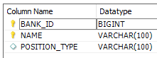

# Hibernate and Java Persistence API (JPA)

## Initial setup

### POM

The libraries we need are:
* Hibernate: Version 4
* log4j: configure also in log4j.properties file
* mysql-connector: Make sure that is the same version of your MySQL installation

### User Entitiy
* Create a POJO with annotations for Mapping the USER table with the User class
* Use @Table annotation for the matching the corresponding Table of the Class
* Use @Column even if is not needed and @Id for the primary key
```java
@Entity
@Table(name="FINANCES_USER")
public class User {

  @Id
  @GeneratedValue(strategy = GenerationType.IDENTITY)
  @Column(name = "USER_ID")
  private Long userId;
```

### Session Factory
The purpose of that is to handle the session, that is the interface between our application and Hibernate.
Create the session factory in a Util class using the Factory pattern.
In this class, we have to say to Hibernate where are the **annotated classes**
```java
Configuration configuration = new Configuration();
configuration.addAnnotatedClass(User.class);
```

### Hibernate properties
Setup the properties to allow Hibernate to connect with the database

### Application
With the configuration above, we can make a test and see if everything is working fine
```java
Session session = HibernateUtil.getSessionFactory().openSession();
session.beginTransaction();
session.close();
```

### Hibernate XML configuration
Instead of using the properties file, we can setup the hibernate configuration in a XML file. This is the most common approach.
You can have a look to all the properties here: https://docs.jboss.org/hibernate/orm/4.3/manual/en-US/html/ch03.html#configuration-programmatic

Also, here **we can map the classes instead of doing it in the code**

```xml
<mapping class="com.infiniteskills.data.entities.User"/>
```

Don't forget to update your SessionFactory to make sure that is using the xml configuration:
```java
configuration.configure(); // Very important
return configuration
        .buildSessionFactory(new StandardServiceRegistryBuilder()
                .applySettings(configuration.getProperties()) // use the xml configuration
                .build());
```
> ❓ Doesn't explain anything about why this code works with the XML file

## Basic Mapping Annotations

### @Access

Defines the access strategy of Hibernate to the entity attributes

```java
@Access(AccessType.FIELD)
```
Access to the attribute directly with reflection

```java
@Access(AccessType.PROPERTY)
```
Access to the attribute with the getter/setter methods. So you can add some logic there


### @Column

```java
@Column(name = "...", updatable = false)
```
Don't include these elements on update actions

```java
@Column(name = "...", nullable = false)
```
This attribute/field can't be null

```java
@Basic
```
Same as "nullable = false" but doesnt't give information to Hibernate on creating the DB Schema

### Identifiers

```java
 @GeneratedValue(strategy = GenerationType.SEQUENCE)
```
Fast but not avaliable for MySQL. Oracle supports

```java
@GeneratedValue(strategy = GenerationType.IDENTITY)
```
Auto-incremented

```java
@GeneratedValue(strategy = GenerationType.TABLE, generator = "user_table_generator")
@TableGenerator(name = "user_table_generator", table = "IFINANCES_KEYS", pkColumnName = "PK_NAME", valueColumnName = "PK_VALUE")
```
Uses another table, IFINANCES_KEYS in this case, to increment the primary key
> ❓ Don't understand

```java
@GeneratedValue(strategy = GenerationType.AUTO)
```

### @Transient
Says to hibernate to **not** map an attribute of an Entity

```java
@Transient
private boolean valid;
```
valid is an attribute of the Entitiy but is not a Column of the DB Table

### @Temporal
To deal with Date/Time types

### @Formula
Used for calculated attributes on runtime

## Hibernate Types

* Entitiy Types: have a database identity
* Vaue Types: no database identitiy
  * Basic
  * Composite Types
  * Collection

```java
@Entity
public class User {
  
  @Id
  private Long userId; //Basic Value Type
  private String firstName; //Basic Value Type
  private User referredBy; //Entity Type
  private List<String> aliases; //Collection Value Type
  private Address address; //Composite Value Type (Embedded in JPA)
}

public class Address { // Auxiliary class. Is not an entity, the values are stored in the User table
  
  private String addressLine1;
  private String addressLine2;
  private String city;
  // ...
}
```  

## Mapping Composite and Collection Types

### Mapping Composite Value Types

Uses an auxiliary class to define the attributes of the entity 

#### @Embeddable
Create a Composite Value Type (CVT) class with the @Embeddable annotation:
```java
@Embeddable // Composite value type
public class Address {

	@Column(name="ADDRESS_LINE_1")
	private String addressLine1;

	@Column(name="ADDRESS_LINE_2")
	private String addressLine2;
	
	@Column(name="CITY")
	private String city;
}
```
This class has the columns but is not an entity by itself. Is used by other entities such as **Bank**

For using this Composite value type class there're 2 ways:

#### @Embedded

If the @Column names of the CVT match with the column names of the Entity, you can directly use the class.
Then, write the getters and setters for all the attributes of the CVT @Embeddable class:
```java
@Entity
@Table(name="BANK")
public class Bank {

	@Embedded // Composite value type. Annotation not needed, Hibernate figures out
	private Address address = new Address();
	
	// Getters and Setters from the Address class
	public String getAddressLine1() {	return address.getAddressLine1();	}
	public void setAddressLine1(String addressLine1) { this.address.setAddressLine1(addressLine1);	}
	public String getCity() {	return address.getCity();	}
	//...
}
```

#### @Embedded + @AttributeOverrides

If not, you can still use the CVT setting in the annotations the column names:
```java
@Embedded
@AttributeOverrides({
   @AttributeOverride(name="addressLine1", column=@Column(name="USER_ADDRESS_LINE_1")),
   @AttributeOverride(name="addressLine2", column=@Column(name="USER_ADDRESS_LINE_2"))})
private Address address;

public Address getAddress() { return address; }
public void setAddress(Address address) { this.address = address; }
```

In this case there're no Getters and Setters of the attribures, directly create the Address object and add it:

```java
Address address = new Address();
address.setAddressLine1("line 1");
address.setAddressLine2("line2");
address.setCity("Philadelphia");
user.setAddress(address);
```
### Mapping Collections Of Basic Value Types

When you have a **One to Many** relationship in the database, you may map it as a Collection or as a Map

#### @ElementCollection: Mapping a Collection 

If you have a One to Many relationship for saving a Basic Value such as a String, Double, etc.
You can use @ElementCollection to map it:

One BANK has many BANK_CONTACTs so we have this relationship:


in **BANK_CONTACT** we just want to save the name of the contact and the id of the bank



From the point of view of the Entity **Bank**, the **BANK_CONTACT** table is a Collection of Strings with the names of the contacts.
Can also be a List, Set...

```java
@ElementCollection // Map a collection of instances
@CollectionTable(name = "BANK_CONTACT", joinColumns = @JoinColumn(name = "BANK_ID")) // Join the id of BANK with this column of BANK_CONTACT
@Column(name = "NAME") // Each String of the contacts collection is an entry in the NAME column
private Collection<String> contacts = new ArrayList<String>();

public Collection<String> getContacts() { return contacts; }
public void setContacts(Collection<String> contacts) { this.contacts = contacts; }
```

And we use it like this:
```java
bank.getContacts().add("Joe");
bank.getContacts().add("Mary");
```

This will add to the **BANK_CONTACT** table 2 new entries.

#### @MapKeyColumn: Mapping a Map

If you have a One to Many relationship for saving a Map, is very similar as @ElementCollection.
But you also have to map the key of the map using @MapKeyColumn

```java
	//Mapping a Map
	@ElementCollection
	@CollectionTable(name="BANK_CONTACT", joinColumns=@JoinColumn(name="BANK_ID"))
	@MapKeyColumn(name="POSITION_TYPE") // Map the column for key of the Map
	@Column(name="NAME")
	private Map<String, String> contacts = new HashMap<String, String>();
```

And then put the contacts in the map
```java
bank.getContacts().put("MANAGER", "Joe");
bank.getContacts().put("TELLER", "Mary");
```